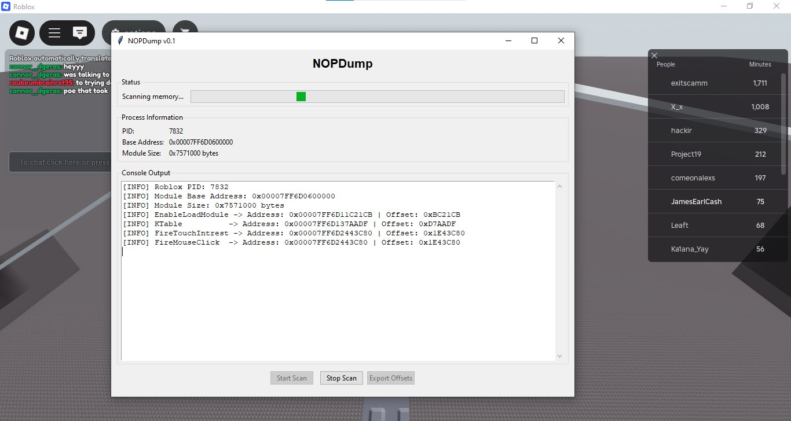

# NOPDump



> Advanced Roblox memory analysis and offsets extraction tool

NOPDump is a powerful memory analysis tool designed specifically for extracting and analyzing offsets from Roblox clients. With both CLI and GUI interfaces, it provides researchers and developers with efficient pattern scanning capabilities.

## Features

- **Dual Interface**: Choose between command-line or graphical user interface
- **Pattern Scanning**: Advanced signature-based memory scanning
- **Real-time Monitoring**: Live process monitoring and analysis
- **Offset Extraction**: Precise extraction of memory offsets from Roblox clients
- **Export Functionality**: Save results to text files for further analysis
- **Process Information**: Detailed view of target process memory layout

## Installation

### Prerequisites
- Windows 10 or later
- Python 3.8 or higher
- RobloxPlayerBeta.exe running

### Setup
1. Clone the repository:
```bash
git clone https://github.com/yourusername/NOPDump.git
cd NOPDump
